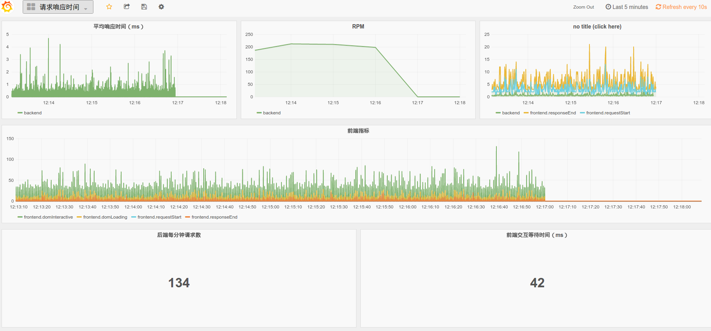

# node-oneapm-decorators
ES7 decorators that can be used in your app to track performance

[](https://www.npmjs.com/package/node-oneapm-decorators)


If you are writting a NodeJS application in ES6(7), you can use this module to track your application performance very easily.

## Background

Let's assume your application definition looks like this

```js
export default class App {
  handleRequest(req, res) {
    res.end('ok');
  }
}
```

Here is how you start the server

```js
import App from './App.es6';
let app = new App();
let server = require('http').createServer(app.handleRequest);
server.listen(3000);
```

## Enhance it

### Show UserAgent of each request

```js
import {useragent} from '../';

export default class App {
  @useragent
  handleRequest(req, res) {
    res.end('ok');
  }
}
```

### Track response time using InfluxDB

```js
import {influxdb} from '../';

export default class App {
  @influxdb({
    host: 'influxdb-longtian.myalauda.cn',
    port: 11431
  })
  handleRequest(req, res) {
    createReadStream(path.join(__dirname, 'index.html')).pipe(res);
  }
}
```

It will continue to flush performance data into InfluxDB, which can be visualized using Grafana



You can set up your own Influxdb server, however here is the [DEMO](http://grafana-longtian.myalauda.cn/)

## How to run the demo

```sh
git clone git@github.com:wyvernnot/node-oneapm-decorators.git
cd node-oneapm-decorators
npm install
npm start
```

## License

MIT

